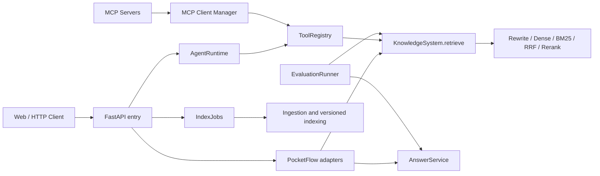

# RAGFlow

基于 FastAPI、PocketFlow 和本地检索模型构建的 RAG 与 Agent 应用。项目提供版本化文档索引、混合检索、带引用回答、会话隔离、Agent 工具调用、SSE 流式输出、可观测性和可复现评测。

当前代码面向本地开发和小规模服务部署。默认评测数据仍是未经人工核验的 AI 生成候选，不能把开发集结果当作正式质量结论。

导航：[架构](#架构) · [配置](#配置) · [MCP](docs/mcp.md) · [索引与回滚](#索引生命周期) · [测试与 CI](#测试与-ci) · [评测](#评测) · [排障](#排障) · [已知限制](#已知限制) · [ADR 0001](docs/adr/0001-core-seams.md)

## 核心能力

| 能力 | 当前行为 |
|---|---|
| RAG 查询 | 查询改写、Dense／BM25、RRF、可选 Rerank、上下文预算和引用约束 |
| Agent | 有界迭代、结构化工具调用、SQLite 短期历史、同步结果与 SSE 共用事件模型 |
| MCP | 官方 SDK 的 stdio 与 Streamable HTTP、动态工具发现、统一 Schema／结果／状态链路 |
| 索引 | 上传、删除、全量重建、版本化 collection、原子发布和回滚 |
| 可靠性 | 并发上限、总时限、有限重试、稳定错误码和显式降级警告 |
| 安全 | 客户端会话隔离、metadata filter 校验、上传校验、工具参数和输出约束 |
| 可观测性 | request/trace ID、阶段 Span、延迟、模型用量、缓存命中和索引版本 |
| 评测 | 版本化数据、确定性检索／引用指标、可选 Ragas、逐样本可复现报告 |

## 架构



核心逻辑集中在少量稳定接口：

- `KnowledgeSystem.retrieve` 隐藏查询改写、候选召回、融合、精排和降级。
- `AnswerService` 统一普通回答与流式回答的上下文、引用和会话落盘语义。
- `AgentRuntime` 统一普通 Agent 响应、事件流和会话重置。
- `MCPRuntime` 管理可选 MCP Server 的后台启动、关闭、工具注册和脱敏状态。
- `IndexJobs` 统一索引任务提交、幂等、状态查询和后台执行。
- `EvaluationRunner` 直接复用检索与生成接口，不另建一套评测专用 RAG。

PocketFlow 只保留离线索引和 RAG 顶层编排。架构决策见 [ADR 0001](docs/adr/0001-core-seams.md)。

## 目录结构

```text
ragrag/
├── app.py                    # FastAPI 入口与 HTTP 路由
├── config/settings.py        # 环境配置及类型校验
├── prompts/                  # 版本化 Prompt
├── scripts/                  # 索引、数据和评测命令
├── src/
│   ├── agent/                # Agent 循环、工具、Hook 和记忆
│   ├── mcp_servers/          # 官方 SDK 实现的本地 MCP Server
│   ├── api/                  # HTTP schema、中间件、SSE 与启动逻辑
│   ├── core/                 # 检索、生成、索引和 Agent 核心接口
│   ├── evaluation/           # 数据规则、指标、Runner 和可选 Judge
│   ├── infra/                # SQLite、Chroma、任务、Trace 等 Adapter
│   ├── orchestration/        # PocketFlow 顶层编排
│   ├── security/             # 会话标识与安全校验
│   ├── utils/                # RRF、BM25 和 Token 工具
│   └── web/                  # 页面、样式和前端脚本
├── data/testset/             # 版本化评测数据和审核说明
└── tests/                    # 默认离线测试与显式真实模型检查
```

运行数据库、索引、日志、模型缓存、评测输出和个人辅助资料不进入 Git。

## 快速开始

### 1. 安装

要求 Python 3.13 和 uv 0.12.11 或更高版本。

```powershell
uv sync --locked --no-default-groups --group dev
Copy-Item .env.example .env
```

如果多个项目共用虚拟环境，可以显式指定环境，不必在仓库内创建 `.venv`：

```powershell
$env:UV_PROJECT_ENVIRONMENT = "C:\path\to\shared\.venv"
uv sync --locked --no-default-groups --group dev --inexact
```

编辑 `.env`，至少设置模型 Provider：

```dotenv
OPENAI_API_KEY=your-key
OPENAI_BASE_URL=https://api.deepseek.com
LLM_MODEL=deepseek-chat
LOCAL_EMBEDDING_MODEL=BAAI/bge-base-en-v1.5
RERANK_MODEL=BAAI/bge-reranker-base
ADMIN_API_KEY=replace-with-a-long-random-secret
CHROMA_PERSIST_DIR=C:\ragflow-data\chroma
```

> Windows 上，Chroma 1.5.9 可能无法重新加载位于中文路径中的 HNSW 文件。建议让 `CHROMA_PERSIST_DIR` 指向纯英文绝对路径。

### 2. 构建索引

将 UTF-8 编码的 `.txt` 或 `.md` 文档放入 `data/raw/`，然后执行：

```powershell
uv run --no-sync python scripts/build_index.py
```

首次运行会加载本地 Embedding 模型。构建完成后会输出文档数、分块数、版本、校验和及 collection 名称。

### 3. 启动

```powershell
uv run --no-sync uvicorn app:app --host 127.0.0.1 --port 8000
```

- RAG 页面：<http://127.0.0.1:8000/>
- Agent 页面：<http://127.0.0.1:8000/agent>
- OpenAPI：<http://127.0.0.1:8000/docs>
- 存活检查：<http://127.0.0.1:8000/health>
- 就绪检查：<http://127.0.0.1:8000/ready>

启动后由一个后台线程按 Embedding → 活跃向量索引／BM25 → 可选 Reranker 的顺序预热，避免多个模型并发加载造成瞬时内存峰值。`/health` 只表示 HTTP 进程存活；`/ready` 在 Embedding 或索引尚未就绪／加载失败时返回 503，必需组件就绪但 BM25 或 Reranker 降级时返回 200 和 `degraded`。低内存机器可设置 `STARTUP_PRELOAD_RERANKER=false`，让精排模型在首次使用 `hybrid+rerank` 时按需加载。

## 配置

环境变量模板见 [`.env.example`](.env.example)。常用配置如下：

| 配置 | 用途 |
|---|---|
| `OPENAI_API_KEY`、`OPENAI_BASE_URL`、`LLM_MODEL` | 兼容 OpenAI 协议的生成模型 |
| `LOCAL_EMBEDDING_MODEL` | 本地向量模型，必须与既有索引维度和语义一致 |
| `RERANK_MODEL`、`RERANK_TIMEOUT_SECONDS`、`STARTUP_PRELOAD_RERANKER` | 本地精排模型、单次时限及是否启动预热 |
| `CHROMA_PERSIST_DIR` | Chroma 持久化目录 |
| `CACHE_DB_PATH`、`CACHE_MAX_ENTRIES` | 精确 LLM 缓存 SQLite 文件及最大记录数 |
| `VECTOR_TOP_K`、`BM25_TOP_K`、`RRF_K`、`RERANK_TOP_K` | 候选召回、融合和精排预算 |
| `ABSTENTION_THRESHOLDS`、`ABSTENTION_CALIBRATION_ID`、`ABSTENTION_CALIBRATION_MODELS` | 人工核验 final 报告校准的分模式阈值、报告哈希及模型绑定 |
| `MAX_CONTEXT_TOKENS`、`SYSTEM_RESERVE_RATIO`、`CONTEXT_BUFFER_RATIO` | 上下文 Token 预算 |
| `MAX_CONCURRENT_QUERIES`、`REQUEST_TIMEOUT_SECONDS`、`LLM_MAX_RETRIES` | 请求容量、总时限和 Provider 重试 |
| `ADMIN_API_KEY`、`ALLOW_UNAUTHENTICATED_ADMIN` | 索引管理密钥及仅限本地开发的显式免认证开关 |
| `AGENT_MAX_ITERATIONS`、`AGENT_MAX_TOOL_CALLS`、`AGENT_MAX_TOKEN_BUDGET` | Agent 运行预算 |
| `AGENT_TIMEOUT_SECONDS`、`AGENT_PLANNER_MAX_TOKENS`、`AGENT_FINAL_MAX_TOKENS` | Agent 时限和生成预算 |
| `TOOL_DEDUP_MAX_SESSIONS` | 工具调用去重状态的最大 session 数 |
| `MCP_SERVERS` | 可选 MCP Server JSON 列表；支持 stdio 与 Streamable HTTP |
| `AGENT_LOG_MAX_BYTES`、`AGENT_LOG_BACKUP_COUNT`、`AGENT_LOG_RETENTION_SECONDS` | Agent 事件与工具审计日志的轮转和保留边界 |
| `PROMPT_VERSION` | 选择 `prompts/<version>/` |
| `LANGFUSE_*` | 预留的远端观测字段；当前运行时未接入 |
| `MAX_UPLOAD_BYTES` | 单文件上传上限 |

配置在进程启动时由 Pydantic 校验。默认必须设置 `ADMIN_API_KEY`；只有服务绑定 `127.0.0.1` 且仅供本机开发时，才可显式设置 `ALLOW_UNAUTHENTICATED_ADMIN=true`。不要在对外监听时启用免认证，也不要提交 `.env`、密钥或本地数据库。

## RAG 接口

### 普通查询

```powershell
curl.exe -X POST http://127.0.0.1:8000/query `
  -H "Content-Type: application/json" `
  -d "{\"query\":\"What is reciprocal rank fusion?\",\"top_k\":5,\"retrieval_mode\":\"hybrid+rerank\"}"
```

请求字段：

- `query`：必填问题，长度为 1～2000 个字符。
- `session_id`：可选；为空时不保存 RAG 历史。
- `top_k`：1～20，控制最终证据数量。
- `retrieval_mode`：`vector_only`、`bm25_only`、`hybrid` 或 `hybrid+rerank`。
- `filter`：受限的 Chroma metadata 条件。

响应包含 `query_id`、`answer`、`sources`、`warnings`、`index_version` 和 `latency_ms`。调用方必须展示 `warnings`。当前稳定 warning code 为：

- `bm25_unavailable`：请求了 BM25，但索引尚未就绪。
- `bm25_version_mismatch`：BM25 索引与本次请求固定的 Dense 索引版本不一致。
- `rerank_timeout`：Reranker 超时，结果退化为融合排序。
- `rerank_unavailable`：Reranker 调用失败，结果退化为融合排序。

BM25 正常参与但没有命中时不返回 warning；`vector_only` 模式不会返回 BM25 warning。

### 流式查询

```text
GET /query/stream?query=...&session_id=...&top_k=5&retrieval_mode=hybrid%2Brerank
```

SSE 使用 `chunk`、`done` 和 `error` 终止语义。只有收到 `done` 才表示回答已完整生成并保存。

### 会话

| 方法 | 路径 | 说明 |
|---|---|---|
| `GET` | `/session/{session_id}` | 查看当前客户端可访问的 RAG 历史 |
| `POST` | `/session/reset?session_id=...` | 清除当前客户端的 RAG 会话 |

公开 session ID 会绑定浏览器客户端身份；另一个客户端即使知道 ID，也不能读取或清除该会话。

## Agent

Agent 通过同一个 `AgentRuntime` 生成普通响应和 SSE 事件。当前默认工具包括：

- `search_knowledge_base`：调用 `KnowledgeSystem.retrieve`，只返回证据。
- `calculator`：执行受限算术表达式。
- `get_weather`：获取天气信息。
- `search_web`：受控外部搜索，属于灰名单工具。

工具调用会校验名称、参数、调用次数和总预算；不可信工具输出带明确边界并截断后再交给模型。普通与流式 Agent 的 `message` 长度均为 1～2000 个字符。

| 方法 | 路径 | 说明 |
|---|---|---|
| `POST` | `/agent/chat` | 普通 Agent 对话 |
| `POST` | `/agent/chat/stream` | `planning → tool_call → tool_done → chunk → done` 事件流；答案完整生成后分块发送，不是 Provider 首 Token 流式 |
| `POST` | `/agent/reset?session_id=...` | 清除当前客户端的 Agent 会话 |
| `GET` | `/agent/memory/{session_id}` | 查看受当前客户端约束的 SQLite 短期历史 |

配置 MCP 后，发现的工具会以 `mcp__{server_id}__{tool_name}` 注册到同一个 ToolRegistry；未配置时保持上述原生工具行为。MCP 工具来源与 Server 状态可通过 `GET /agent/tools` 查看。

若强制最终回答生成失败，Agent 返回 `agent_final_generation_failed`，记录失败 Trace，且不写入本轮历史。

示例：

```powershell
curl.exe -X POST http://127.0.0.1:8000/agent/chat `
  -H "Content-Type: application/json" `
  -d "{\"message\":\"Search the knowledge base for Ada Lovelace and summarize the evidence.\"}"
```

## MCP

MCP 默认关闭。设置 `MCP_SERVERS` 后，应用会在后台连接启用的 Server；连接失败或握手等待不会阻塞核心 HTTP 服务。stdio 和 Streamable HTTP 共用工具注册、完整 JSON Schema 校验、结果安全、审计和状态模型，工具调用默认不自动重试。

内置时间 Server 可通过 stdio 开箱演示；远程 URL 使用 Streamable HTTP。配置示例、官方 Inspector 命令、真实传输测试和明确的能力边界见 [MCP 集成](docs/mcp.md)。基础 HTTP 支持不包含 OAuth、多租户、高可用或持久化审批。

可观测入口：

- `GET /agent/tools`：原生与 MCP 工具来源、Provider、分类、安全等级、可用性和脱敏 Server 状态。
- `GET /ready`：MCP 作为可选组件汇总；MCP 不可用时核心服务仍按自身状态报告 readiness。

## 索引生命周期

全量构建根据语料内容生成不可变版本和 `rag_v_<version>` collection；构建成功后再原子切换 active 指针。旧的 `rag_collection` 仍可作为无 manifest 时的兼容索引。

在线索引操作返回 `202 Accepted` 和 `job_id`。除任务状态查询外，以下接口必须携带 `X-Admin-Key`，其值与 `ADMIN_API_KEY` 一致：

| 方法 | 路径 | 说明 |
|---|---|---|
| `POST` | `/upload?replace=false` | 新增或显式替换文档 |
| `DELETE` | `/documents/{filename}` | 删除文档并重建版本 |
| `POST` | `/index/rebuild` | 重建当前语料 |
| `POST` | `/index/rollback?version_id=...` | 激活指定版本；省略版本时回到前一版本 |
| `GET` | `/index/jobs/{job_id}` | 查询任务状态 |

修改请求可携带 `Idempotency-Key`，重复提交同一操作会复用已有任务。上传、删除和发布使用同一后台任务通道，避免并发覆盖。

```powershell
$adminKey = Read-Host "ADMIN_API_KEY"
curl.exe -X POST http://127.0.0.1:8000/index/rebuild `
  -H "X-Admin-Key: $adminKey" `
  -H "Idempotency-Key: rebuild-v1"
```

## 可靠性与安全

- HTTP 请求先执行客户端身份、Trace 和容量／时限中间件。
- 查询改写失败时保留原问题；BM25、向量召回或 Rerank 不可用时返回稳定警告并按可用链路降级。
- RAG 会话历史和 Agent SQLite 短期历史按客户端身份派生内部存储 ID，接口不暴露实际路径。
- metadata filter 只接受有限操作符、深度、分支数和标量类型。
- 上传校验扩展名、文件名、大小和目标路径，索引发布采用原子替换。
- 页面使用文本节点和安全 Markdown 渲染，响应设置 CSP 等安全头。
- Agent 拒绝未注册工具、越界参数和超过迭代、工具、Token 或总时间预算的执行。

## 可观测性

普通响应和 SSE 都返回 `X-Request-ID` 与 `X-Trace-ID`。本地 Trace 默认追加到 `logs/traces.jsonl`，覆盖查询改写、候选检索、Rerank、上下文构建、模型生成、Agent 和工具调用。
Agent 事件与工具审计 JSONL 按配置的单文件大小轮转，并同时受备份数量和保留时长约束。

Trace 记录稳定错误码、耗时、模型名、Token、缓存命中和索引版本；不记录完整查询、回答、会话身份、凭据或原始工具参数。`LANGFUSE_*` 目前只是预留配置，运行时不会向 Langfuse 发送 Trace。

## 评测

评测数据规则见 [`data/testset/README.md`](data/testset/README.md)。当前 56 条 development 样本由 AI 生成且未经人工核验；`final_v1.json` 只有人工确认后才能加入样本。单文档组合事实使用 `multi_fact`，`multi_hop` 仅表示至少需要两个不同来源的跨文档问题。

### 数据校验

```powershell
uv run --no-sync --offline --no-env-file python scripts/validate_eval_dataset.py
```

### 5 条真实 RAG smoke

```powershell
uv run --no-sync --offline --no-env-file python scripts/run_eval.py --split development --limit 5
```

默认只运行 `hybrid+rerank`。报告写入被忽略的 `data/eval-runs/`，保存逐样本答案、证据、引用、错误、Trace、Token 和复现信息。正式报告可作为 CI artifact、Release 附件或受控附件交付，不要求提交原始报告；final 评测只允许在干净提交上运行，报告会绑定代码 SHA、数据与索引版本、模型、Prompt、完整配置和 seed。

> 独立评测进程不会执行 FastAPI startup。运行前应确认 Chroma 可加载、Reranker 权重可用，并检查日志中 BM25 是否实际参与；出现降级警告时不能把结果描述为完整 hybrid+rerank。

### 完整评测

```powershell
# 四模式消融；只对人工核验后的 final 数据执行
uv run --no-sync --offline --no-env-file python scripts/run_eval.py --split final --ablation

# 从同一份人工核验 final 报告生成拒答阈值建议
uv run --no-sync --offline --no-env-file python scripts/calibrate_abstention.py data/eval-runs/<report>.json

# Ragas Faithfulness / Relevancy；先安装 eval 依赖，再执行模型评判
uv sync --locked --no-default-groups --group eval
uv run --no-sync --offline --no-env-file --group eval python scripts/run_eval.py --split final --with-ragas
```

Recall@K、MRR、NDCG 和引用指标是确定性指标；Faithfulness 与 Relevancy 只有显式启用 Ragas 才计算。报告同时给出正确拒答率、错误拒答率和应拒答样本的硬答率。development 指标只能用于调试，不能作为发布门槛；对外引用指标时必须同时提供可访问的报告 artifact 或附件及其 run_id，不引用缺少复现信息的历史数值。阈值校准器拒绝非 final 报告，输出的 thresholds、calibration_id 与 models 必须一起配置，且模型必须与运行时一致。未配置阈值时，系统只对空检索结果确定性拒答，不根据任意固定分数拒答。

## 测试与 CI

默认测试全部离线，不调用真实模型、浏览器或 Ragas。MCP 测试仅使用真实本地子进程和数值型 loopback Server，不访问外部 MCP 服务：

```powershell
$env:PYTEST_DISABLE_PLUGIN_AUTOLOAD = "1"
uv lock --check --offline
uv run --no-sync --offline --no-env-file python -B -m pytest -q
```

真实模型检查需要单独运行：

```powershell
uv run --no-sync --offline --no-env-file python tests/test_smoke.py
uv run --no-sync --offline --no-env-file python tests/test_agent.py
```

Ragas 依赖位于 `eval` 组，不进入默认 CI。Windows 与 Linux 的离线检查定义在 [`.github/workflows/offline-checks.yml`](.github/workflows/offline-checks.yml)。

## 排障

### 找不到 `rag_collection`

当前 Chroma 目录没有 legacy collection 或 active manifest。确认 `CHROMA_PERSIST_DIR` 后运行 `scripts/build_index.py`。

### `Error loading hnsw index`

先执行 SQLite 完整性检查并确认 HNSW 分片齐全。Windows 下若仓库路径含中文，将索引复制到纯英文目录并修改 `CHROMA_PERSIST_DIR`；不要只复制 `chroma.sqlite3`。

### `rerank_unavailable`

Reranker 权重未缓存、模型路径错误、资源不足或超时。准备完整模型后重启；服务会在启动日志中报告预热结果。降级期间使用 RRF 顺序。

### BM25 命中为 0

服务启动时会在 Embedding 之后从当前 Chroma collection 重建 BM25。查看 `/ready`：索引不可读时返回 503；仅 BM25 重建失败时返回 200 和 `degraded`，查询降级为纯向量。

### `final` 没有样本

这是数据质量保护。按 `data/testset/README.md` 完成人工审核、来源校验和版本更新后再运行正式评测。

### 共享虚拟环境被 uv 重建

先激活目标环境并设置 `UV_PROJECT_ENVIRONMENT`，随后使用 `uv run --no-sync`。只有依赖确实变化时才执行 `uv sync`。

## 已知限制

- 开发评测数据未经人工核验，不能用于发布门槛。
- 本地 Embedding 与 Reranker 首次加载需要模型文件、内存和启动时间。
- Windows 下 Chroma HNSW 对 Unicode 持久化路径存在兼容问题。
- 完整 Agent 评测和新旧实现对照仍待补充。
- Agent 当前仍使用 JSON Planner；模型原生 Tool Calling、MCP OAuth、多租户、高可用和持久化 HITL 尚未实现。

## License

MIT
